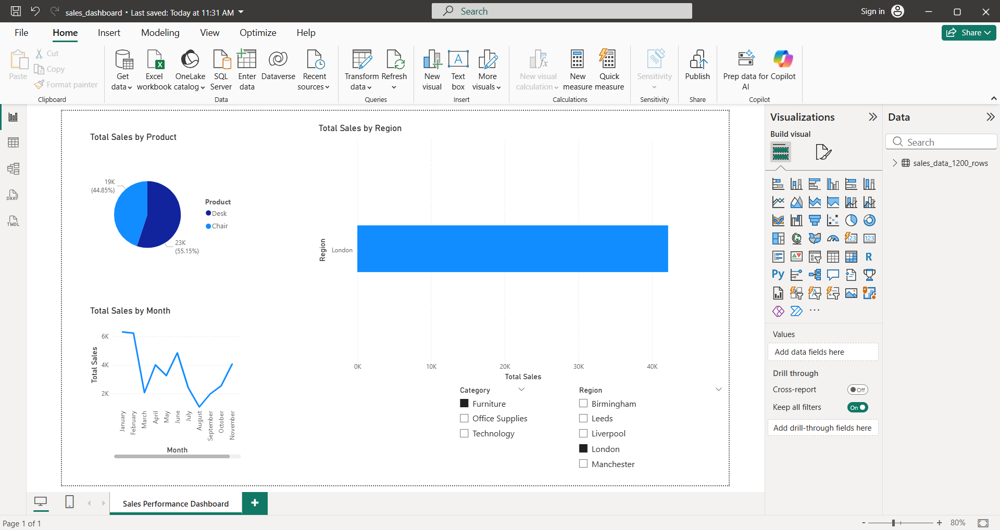

\# Sales & Performance Analytics Dashboard

\

\## Project Overview This project demonstrates an \*\*end-to-end data
analytics workflow\*\* using SQL, Excel, and Power BI on a realistic
sales dataset. It showcases interactive dashboards, KPI calculations,
and insights into regional, product, and category-level performance.

\## Dataset - File: \`sales_data_1200_rows.csv\`  - 1200+ rows covering:
 - Multiple regions (UK-based)  - Various products & categories  -
Sales, profit, and quantity metrics  - 2 years of time-series data for
trend analysis

\## Dashboard Features - \*\*KPI Cards\*\*: Total Sales, Total Profit,
Total Orders - \*\*Sales by Region\*\*: Compare sales performance across
regions - \*\*Monthly Sales Trend\*\*: Track sales over time with a line
chart - \*\*Category Distribution\*\*: Visualize sales share per product
category - \*\*Top Products\*\*: Identify highest-selling products -
\*\*Interactive Filters\*\*: Region and Category slicers for drill-down
analysis

\## Tools & Skills - \*\*Power BI Desktop\*\* -- dashboard creation,
interactive visuals - \*\*Excel\*\* -- initial data handling and
transformation - \*\*SQL\*\* -- optional data exploration and
aggregation - \*\*Data Cleaning & Transformation\*\* -- ensuring
accurate analysis - \*\*Data Visualization\*\* -- charts, KPIs, and
trend analysis - \*\*GitHub\*\* -- project version control and sharing

\## How to Use 1. Open \`sales_dashboard.pbix\` in Power BI Desktop. 2.
Load the dataset \`sales_data_1200_rows.csv\`. 3. Explore interactive
visuals and use filters to analyze performance. 4. View top products,
trends, and regional insights.

\## Project Structure
